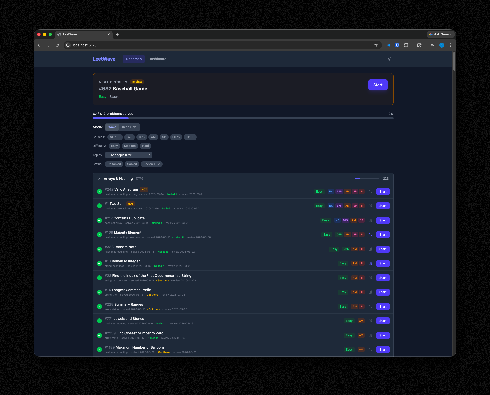
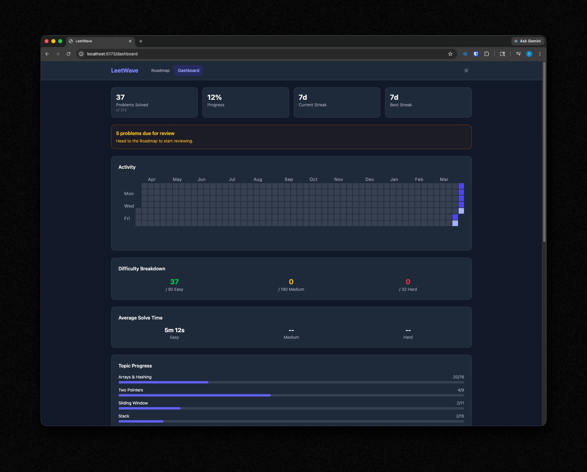

# LeetWave

A personal LeetCode study tracker that combines 7 curated problem lists with spaced repetition. Built for structured interview prep with a wave-based progression system that interleaves topics and difficulties so you build breadth before depth.



## What It Does

LeetWave merges 312 problems from NeetCode 150, Blind 75, Grind 75, Algomap, Sean Prashad's LeetCode Patterns, LeetCode 75 Study Plan, and Top Interview 150 into a single deduplicated roadmap. Problems appearing across more lists are prioritized higher — if five separate curated lists agree you should know a problem, you see it first.

The app organizes problems into 9 progressive waves, from foundational easy problems through advanced patterns and hard problems. A built-in spaced repetition system resurfaces problems for review based on how well you knew them, keeping older material fresh while you work through new problems.

### Key Features

- **Wave-based progression** — 9 waves interleave topics and difficulties so you're never grinding one category too long
- **Deep Dive mode** — Toggle to topic-sequential ordering when you want to hammer a specific pattern
- **Spaced repetition** — Three-tier confidence ratings (Nailed it / Got there / Had to learn) with interval-based review scheduling
- **Built-in timer** — Tracks solve time per problem with auto-suggested confidence ratings based on difficulty benchmarks
- **Progress dashboard** — Visual overview of completion, review schedule, and topic breakdown


- **Cross-reference priority** — Problems recommended by more source lists are served first within each wave
- **Direct LeetCode links** — One click to open any problem on LeetCode
- **Local storage persistence** — All progress saved in your browser, no account needed

## Getting Started

```bash
# Install dependencies
npm install

# Start dev server
npm run dev
```

The app runs at `http://localhost:5173` by default.

## Tech Stack

React 18, Vite, Tailwind CSS v4, React Router. No backend — everything runs client-side with localStorage for persistence.

## Source Lists

LeetWave's problem set is curated from these well-regarded lists. Full credit to the creators:

| List | Author | Problems |
|------|--------|----------|
| [NeetCode 150](https://neetcode.io/roadmap) | NeetCode | 150 |
| [Blind 75](https://www.teamblind.com/post/New-Year-Gift---Curated-List-of-Top-75-LeetCode-Questions-to-Save-Your-Time-OaM1orEU) | yangshun | 75 |
| [Grind 75](https://www.techinterviewhandbook.org/grind75) | yangshun | 75 |
| [Algomap](https://algomap.io/) | Algomap | ~100 |
| [LeetCode Patterns](https://seanprashad.com/leetcode-patterns/) | Sean Prashad | ~90 |
| [LeetCode 75](https://leetcode.com/studyplan/leetcode-75/) | LeetCode | 75 |
| [Top Interview 150](https://leetcode.com/studyplan/top-interview-150/) | LeetCode | 150 |

After deduplication and cross-referencing: **312 unique problems**.

## Wave System

Problems are organized into 9 waves for progressive difficulty ramp-up:

| Wave | Name | Focus |
|------|------|-------|
| 1 | Foundations | Easy problems in core topics (Arrays, Two Pointers, Sliding Window, Stack, Binary Search, Linked List) |
| 2 | Foundations - Intermediate | Medium problems in the same core topics |
| 3-4 | Trees & Heaps | Easy then Medium in Trees, Heaps, Tries |
| 5-6 | Graphs & Backtracking | Easy then Medium in Graphs, Backtracking |
| 7-8 | Advanced Patterns | Easy then Medium in DP, Greedy, Intervals, Math, Bit Manipulation |
| 9 | Hard Problems | All Hard problems across every topic |

## Project Structure

```
src/
  components/    # React components (RoadmapView, Dashboard, Timer, etc.)
  context/       # App-wide state management
  data/          # seedData.json (312 problems with metadata)
  hooks/         # Custom hooks for problems, stats, timer
  utils/         # Spaced repetition engine, storage, date utilities
```

## Note

LeetWave is a study guide and progress tracker — it does not replicate or host LeetCode content. Some problems in the roadmap may require a [LeetCode Premium](https://leetcode.com/subscribe/) subscription to access.

## Acknowledgments

Built with assistance from [Claude](https://claude.ai) (Anthropic).
